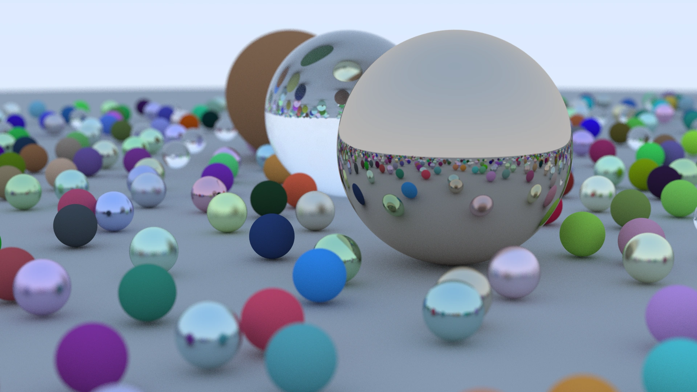

# Zig Ray Tracer

Multi-threaded ray tracer written in [Zig](https://ziglang.org/).
Based on a probably now outdated version of [Ray Tracing in One Weekend](https://raytracing.github.io/books/RayTracingInOneWeekend.html).